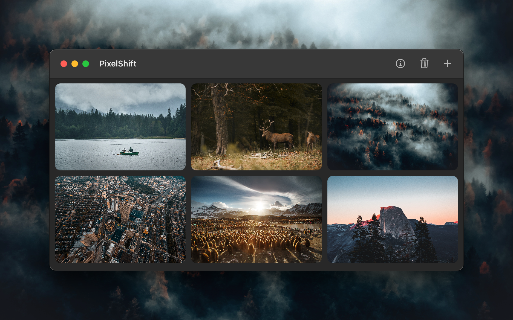
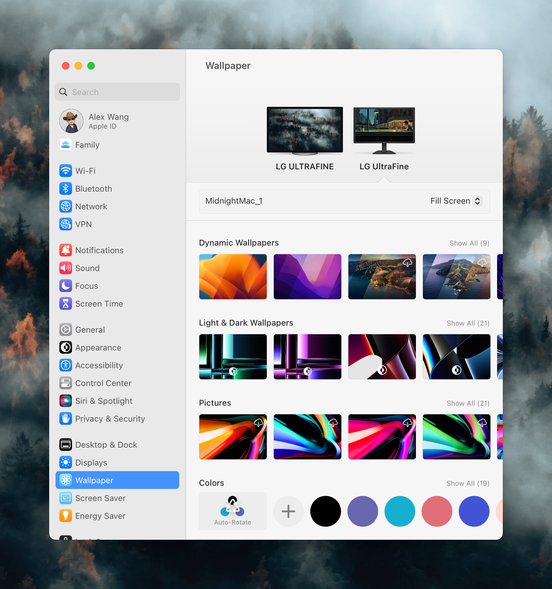

# PixelShift - An Opinionated Wallpaper Switcher for macOS

TLDR:

PixelShift is a macOS app that enhances your experience by seamlessly switching between your favorite wallpapers.

## Demo

https://youtu.be/BSyzNuu0eMU

## Usage

Upload several wallpapers, then click on the image to switch. To start over, click on the trash can to empty your selection. It's as simple as that!

## Motivation

As macOS evolves, the system's default wallpaper library continues to grow. This can make it challenging to easily set wallpapers from a user's folder. To solve this problem, I created this little app.

## Feedback

For any issues or suggestions, please [click here ↗](https://github.com/chang2000/pixelshift/issues) or [send us an email](mailto:wangtcalex@gmail.com).

Enjoy your new wallpaper experience with PixelShift!